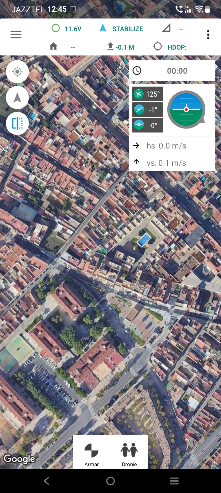
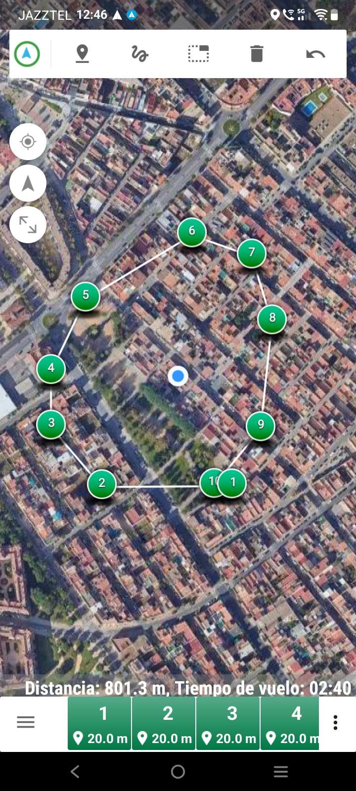
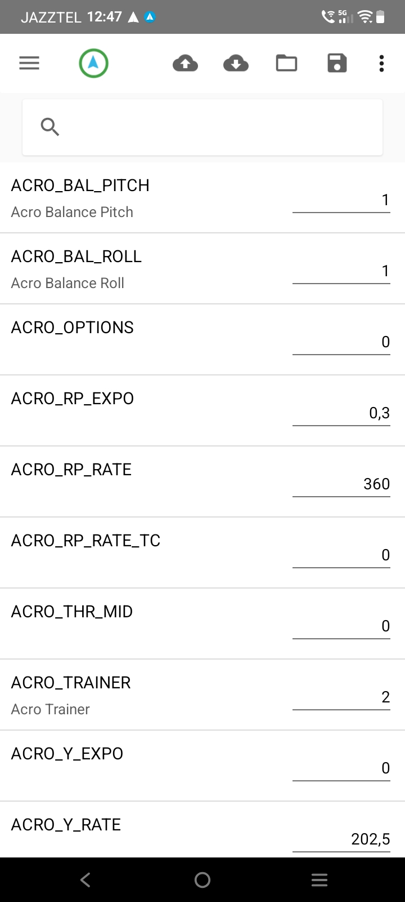

# Tower GCS

**An Android ground control station (GCS) for drones running [ArduPilot](https://ardupilot.org).**
Fly and monitor multicopters, planes and rovers from an Android phone or tablet
over MAVLink 1 or MAVLink 2.

Tower GCS is a maintained fork of the original
[DroidPlanner / Tower](https://github.com/DroidPlanner/Tower) Android app (2016),
rebuilt to install and run on **Android 10 through Android 16**.

  <a href="https://github.com/nomar2/Tower/releases/latest"><strong>⬇ Download the latest APK</strong></a>
  &nbsp;·&nbsp;
  <a href="https://github.com/nomar2/Tower">Source on GitHub</a>

## Screenshots

<!-- Add PNGs to docs/img/ : flight.png, editor.png, params.png -->

| Flight screen | Mission editor | Parameters |
|---|---|---|
|  |  |  |

## What it does

- **Live telemetry & flight control** — attitude, position, battery, GPS,
  flight-mode switching, arm / disarm, takeoff, GUIDED "go here".
- **Mission planning** — draw waypoint and survey missions on the map, upload
  to the vehicle, download, and run them. Clear the mission stored on the
  vehicle.
- **Parameters** — read and write the full ArduPilot parameter set.
- **GUIDED follow-me** — the phone streams its filtered position and velocity to
  the vehicle at 5 Hz.
- **Reboot flight controller** from the connected menu.

## Connections

| Link | Notes |
|---|---|
| **USB serial** | SiK telemetry radio (433 / 915 MHz) on a USB-OTG cable |
| **Wi-Fi** | UDP or TCP to a Wi-Fi telemetry bridge or SITL |
| **TCP / UDP** | direct to any MAVLink endpoint |

MAVLink 2 is auto-negotiated; MAVLink 1 links keep working.

## Tested

Flown against a MINI Pix running **ArduCopter 4.7.0**, MAVLink 1 and 2, over
USB-serial SiK radio, Wi-Fi, TCP and UDP. Verified on phones from **Android 10
to Android 16**.

Follow-me (all sub-modes) and auto missions are validated end-to-end against
SITL through the app (ArduCopter 4.7.1, MAVLink 2), with the phone's real GPS.
Not yet flown on a vehicle: follow-me and the dronie.

## Build it yourself

See the [README](https://github.com/nomar2/Tower#building). JDK 17, the Android
SDK, and your own Google Maps API key.

## Licence

GPLv3. A modified version of DroidPlanner/Tower — original work by Arthur
Benemann, 3D Robotics and the Tower / DroidPlanner contributors; modernisation
(2026) by Ramón José Moreno and Alejandro Moreno.
